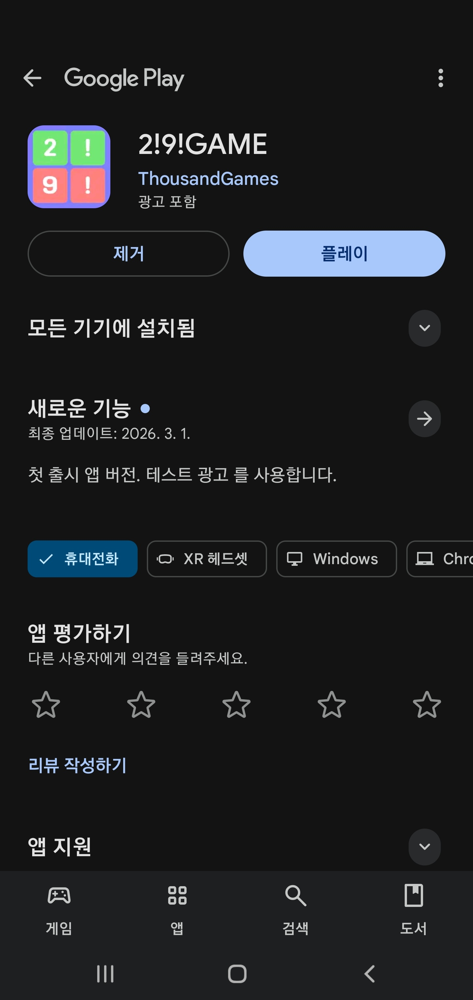
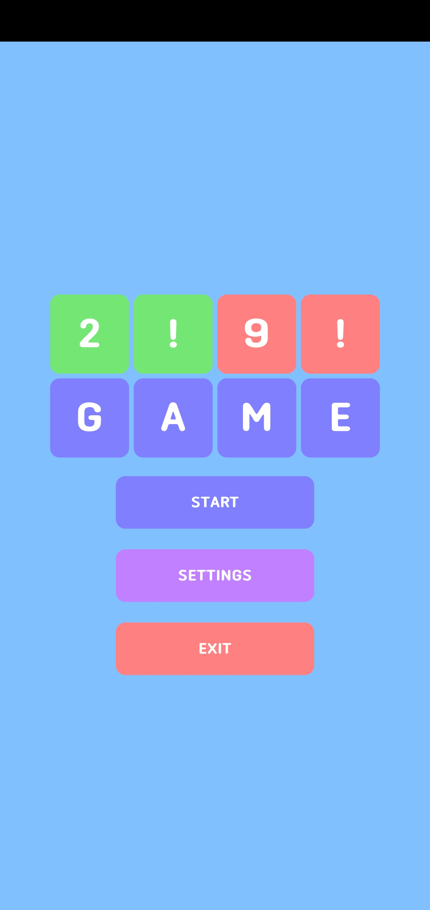
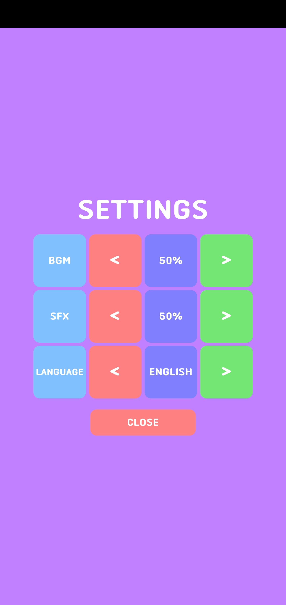
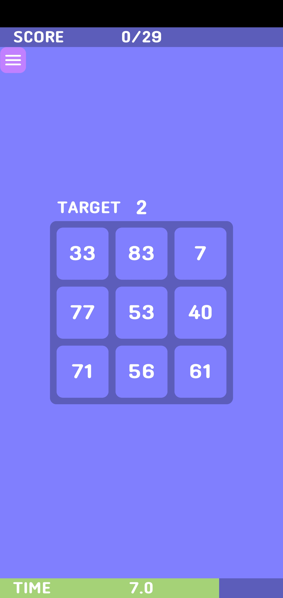
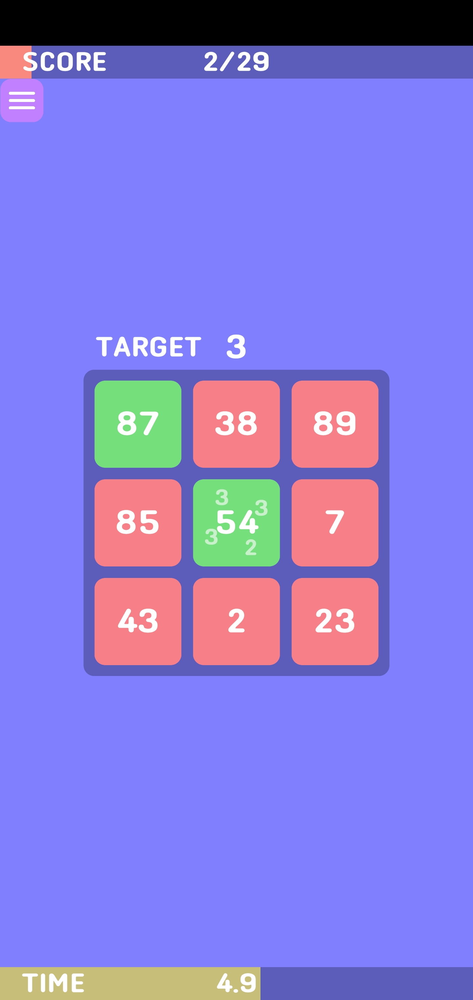
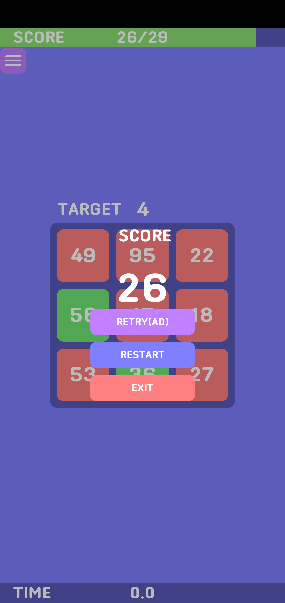

# 2!9!GAME

## 게임 설명













2!9!GAME은 빠른 시간 안에 9개의 숫자 중 목표 숫자의 배수를 찾아내고 더욱 어려운 라운드를 끝없이 진행하는 캐주얼 아케이드 모바일 게임입니다.

---

## 플레이 영상

[](https://youtu.be/2KPtFfziiCk?t=0s)

---

## 주요 기능 소개

### 경량 Localization 시스템 구축

외부 라이브러리 의존도를 줄이고, 필요한 최소한의 기능들만 구현한 경량 Localization시스템을 설계했습니다. ScriptableObject 형태로 설계하여 쉽게 유지 보수할 수 있도록 했습니다.

- 언어에 따른 텍스트 테이블을 딕셔너리로 관리
- 텍스트 테이블 내에서 Key값을 통해 실제 텍스트를 관리
- 언어 변경 이벤트를 통해 언어 변경 시 UI 동기화를 구현

- LocalizedTextTableData
    
    ```csharp
    /// <summary>
    /// 로컬라이즈된 텍스트 테이블을 담는 스크립터블 오브젝트
    /// </summary>
    [CreateAssetMenu(fileName = "LocalizedTextTableData", menuName = "SO/Localization/LocalizedTextTableData", order = 0)]
    public class LocalizedTextTableData : ScriptableObject
    {
        [Header("Localized Text Table")]
        [SerializeField] private SerializableDictionary<string, string> _localizedTextTable = new();
        public SerializableDictionary<string, string> LocalizedTextTable => _localizedTextTable;
    }
    ```
    
- LocalizationTableData
    
    ```csharp
    /// <summary>
    /// 로컬라이제이션 테이블을 담는 스크립터블 오브젝트
    /// </summary>
    [CreateAssetMenu(fileName = "LocalizationTableData", menuName = "SO/Localization/LocalizationTableData", order = 0)]
    public class LocalizationTableData : ScriptableObject
    {
        [Header("Localization Table")]
        [SerializeField] private SerializableDictionary<LanguageType, LocalizedTextTableData> _localizationTable = new();
        public SerializableDictionary<LanguageType, LocalizedTextTableData> LocalizationTable => _localizationTable;
    }
    ```
    
- LocalizationManager
    
    ```csharp
    /// <summary>
    /// 로컬라이제이션을 관리하는 싱글톤 클래스
    /// </summary>
    public class LocalizationManager : Singleton<LocalizationManager>
    {
        [Header("Localization Table Data")]
        [SerializeField] private LocalizationTableData _localizationTableData;
    
        #region 변수
        public LanguageType CurrentLanguage { get; private set; } = LanguageType.English;
        #endregion
    
        #region 레퍼런스
        private SettingsManager _settingsManager;
        #endregion
    
        #region 이벤트
        public event Action<LanguageType> OnLanguageChanged;
        #endregion
    
        private void OnDestroy()
        {
            // 이벤트 해제
            UnregisterEvents();
        }
    
        #region 초기화
        public void Init(SettingsManager settingsManager)
        {
            // 레퍼런스 설정
            _settingsManager = settingsManager;
    
            // 이벤트 등록
            RegisterEvents();
    
            // 초기 언어 설정
            SetLanguage(_settingsManager.SettingsData.Language);
        }
        #endregion
    
        #region 이벤트 구독, 해제
        private void RegisterEvents()
        {
            // 설정 변경 이벤트 구독
            _settingsManager.OnLanguageChanged += SetLanguage;
        }
    
        private void UnregisterEvents()
        {
            // 설정 변경 이벤트 해제
            _settingsManager.OnLanguageChanged -= SetLanguage;
        }
        #endregion
    
        public void SetLanguage(LanguageType languageType)
        {
            // 현재 언어라면 패스
            if (CurrentLanguage == languageType) return;
    
            // 언어 변경
            CurrentLanguage = languageType;
    
            // 이벤트 호출
            OnLanguageChanged?.Invoke(CurrentLanguage);
        }
    
        public string GetLocalizedText(string key)
        {
            // 데이터가 없으면 키 반환
            if (_localizationTableData == null) return key;
    
            // 테이블 가져오기
            var localizationTable = _localizationTableData.LocalizationTable;
    
            // 테이블이 없으면 키 반환
            if (localizationTable == null) return key;
    
            // 현재 언어에 대한 텍스트 테이블 데이터가 없으면 키 반환
            if (!localizationTable.TryGetValue(CurrentLanguage, out var localizedTextTableData)) return key;
    
            // 텍스트 테이블 가져오기
            var localizedTextTable = localizedTextTableData.LocalizedTextTable;
    
            // 텍스트 테이블이 없으면 키 반환
            if (localizedTextTable == null) return key;
    
            // 현재 언어에 대한 텍스트 테이블이 없으면 키 반환
            if (!localizedTextTable.TryGetValue(key, out var text)) return key;
    
            // 텍스트 반환
            return text;
        }
    }
    
    ```
    
- LocalizedText
    
    ```csharp
    /// <summary>
    /// 텍스트를 로컬라이즈하는 컴포넌트
    /// </summary>
    [RequireComponent(typeof(TMP_Text))]
    public class LocalizedText : MonoBehaviour
    {
        [Header("Localization Key")]
        [SerializeField] private string _localizationKey;
    
        #region 레퍼런스
        private TMP_Text _text;
        #endregion
    
        #region 변수
        private bool _isRegistered = false;
        #endregion
    
        private void Awake()
        {
            // 레퍼런스 초기화
            if (_text == null) _text = GetComponent<TMP_Text>();
        }
    
        private void Start()
        {
            // 싱글톤 초기화 오류를 방지하기 위해 Start에서 OnEnable 호출
            OnEnable();
        }
    
        private void OnEnable()
        {
            // 이벤트 구독
            RegisterEvents();
    
            // 싱글톤이 없으면 패스
            if (LocalizationManager.Instance == null) return;
    
            // 텍스트 초기화
            UpdateLocalizedText(LocalizationManager.Instance.CurrentLanguage);
        }
    
        private void OnDestroy()
        {
            // 이벤트 구독 해제
            UnregisterEvents();
        }
    
        #region 이벤트 구독, 해제
        private void RegisterEvents()
        {
            // 중복 등록 방지
            if (_isRegistered) return;
    
            // 싱글톤이 없으면 패스
            if (LocalizationManager.Instance == null) return;
    
            // 이벤트 구독
            LocalizationManager.Instance.OnLanguageChanged += UpdateLocalizedText;
    
            // 플래그 설정
            _isRegistered = true;
        }
    
        private void UnregisterEvents()
        {
            // 등록되지 않았으면 패스
            if (!_isRegistered) return;
    
            // 싱글톤이 없으면 패스
            if (LocalizationManager.Instance == null) return;
    
            // 이벤트 구독 해제
            LocalizationManager.Instance.OnLanguageChanged -= UpdateLocalizedText;
    
            // 플래그 설정
            _isRegistered = false;
        }
        #endregion
    
        private void UpdateLocalizedText(LanguageType languageType)
        {
            // 싱글톤이 없으면 패스
            if (LocalizationManager.Instance == null) return;
    
            // 로컬라이즈된 텍스트 가져오기
            string localizedText = LocalizationManager.Instance.GetLocalizedText(_localizationKey);
    
            // 텍스트 설정
            _text.text = localizedText;
        }
    }
    ```
    

### AdMob과 연동한 보상형 광고 시스템

AdMob SDK를 연동하여 보상형 광고 시스템을 구축했습니다. 플레이어가 선택하여 광고를 시청할 수 있게 하고, 게임 진행과 밀착하여 광고 시청률을 높이도록 설계했습니다.

- Callback 시스템을 통해 광고 시청 완료 여부를 확인하고 보상을 지급합니다.
- 광고를 로드할 수 있는지 여부를 확인하고, 광고 로드 실패 시의 예외처리를 했습니다.
- AdMob의 광고 ID를 ScriptableObject에 저장하여 게임의 테스트와 출시 시에 광고 ID를 간편하게 변경하고, 외부에 ID를 노출하지 않도록 설계했습니다.

- AdManager
    
    ```csharp
    // 모바일 플랫폼인지 확인
    #if UNITY_ANDROID || UNITY_IOS
    #define MOBILE_PLATFORM
    #endif
    
    using System;
    using UnityEngine;
    
    // 모바일 플랫폼인 경우만 사용
    #if MOBILE_PLATFORM
    using GoogleMobileAds.Api;
    #endif
    
    /// <summary>
    /// 안드로이드 광고를 관리하는 싱글톤 클래스
    /// </summary>
    public class AdManager : Singleton<AdManager>
    {
        [Header("Ad Data")]
        [SerializeField] private AdData _adData;
    
    #if MOBILE_PLATFORM
        #region 광고 ID
        private string _rewardId;
        #endregion
    
        #region 광고 객체
        private RewardedAd _rewardedAd;
        #endregion
    #endif
    
        // 모바일 플랫폼인 경우에만 함수 구현
    #if MOBILE_PLATFORM
        override protected void Awake()
        {
            // 싱글톤 초기화
            base.Awake();
    
            // 광고 ID 할당
            if (_adData != null)
            {
                _rewardId = _adData.AndroidRewardId;
            }
    
            // 모바일 광고 초기화
            MobileAds.Initialize(initStatus =>
            {
                // 보상형 광고 로드
                LoadRewardedAd();
            });
        }
    
        private void LoadRewardedAd()
        {
            // 보상형 광고 로드
            RewardedAd.Load(_rewardId, new(), (ad, error) =>
            {
                // 광고 로드 실패 시 패스
                if (error != null) return;
    
                // 보상형 광고 할당
                _rewardedAd = ad;
            });
        }
    #endif
    
        /// <summary>
        /// 보상형 광고를 보여줄 수 있는지 여부
        /// </summary>
        public bool CanShowRewardedAd()
        {
    #if MOBILE_PLATFORM
            // 모바일인 경우에만 체크
            return _rewardedAd != null && _rewardedAd.CanShowAd();
    #else
            // 모바일이 아닌 경우 항상 false 반환
            return false;
    #endif
        }
    
        /// <summary>
        /// 보상형 광고 보여주기
        /// </summary>
        public void ShowRewardedAd(Action onRewarded)
        {
    #if MOBILE_PLATFORM
            // 모바일인 경우에만 실행
    
            // 보상형 광고를 보여줄 수 없으면 패스
            if (!CanShowRewardedAd()) return;
    
            _rewardedAd.Show((reward) =>
            {
                // 광고 시청 완료 후 보상 콜백 호출
                onRewarded?.Invoke();
    
                // 다음 광고를 위해 새로 로드
                LoadRewardedAd();
            });
    #else
            // 모바일이 아닌 경우 패스
            return;
    #endif
        }
    }
    ```
    
- AdData
    
    ```csharp
    /// <summary>
    /// 광고 관련 데이터를 담는 SO
    /// 기본값은 테스트 광고 ID
    /// </summary>
    [CreateAssetMenu(fileName = "AdData", menuName = "SO/Ad/AdData", order = 0)]
    public class AdData : ScriptableObject
    {
        [Header("Android Ad IDs")]
        [SerializeField] private string _androidRewardId = "ca-app-pub-3940256099942544/5224354917";
        public string AndroidRewardId => _androidRewardId;
    }
    ```
    

### Google Play와 연동한 자동 업데이트 시스템

Google Play SDK를 연동하여 게임 실행 시 최신 업데이트를 확인하고 설치할 수 있도록 합니다. 이를 통해 모든 유저가 동일한 버전에서 같은 경험을 할 수 있도록 설계했습니다.

- 번들 버전 코드를 통해 자동으로 앱 버전 비교
- 게임 실행 시 업데이트를 확인하고 업데이트 화면 표시
- 업데이트 실패 또는 강제 취소 시 게임을 종료해서 예외를 방지

- UpdateManager
    
    ```csharp
    #if UNITY_ANDROID && !UNITY_EDITOR
    #define USE_PLAY_CORE
    #endif
    
    using System.Collections;
    
    #if USE_PLAY_CORE
    using UnityEngine;
    using Google.Play.AppUpdate;
    #endif
    
    /// <summary>
    /// Google Play의 인 앱 업데이트를 관리하는 매니저 클래스
    /// </summary>
    public class UpdateManager : Singleton<UpdateManager>
    {
    #if USE_PLAY_CORE
        #region 변수
        private AppUpdateManager _appUpdateManager;
        #endregion
    
        override protected void Awake()
        {
            base.Awake();
    
            // AppUpdateManager 초기화
            _appUpdateManager = new();
        }
    #endif
    
    #if USE_PLAY_CORE
        private void Start()
        {
            // 업데이트 확인 코루틴 시작
            StartCoroutine(CheckForUpdate());
        }
    #endif
    
        /// <summary>
        /// 업데이트를 확인하고, 업데이트가 가능하면 즉시 업데이트를 시작하는 코루틴
        /// </summary>
        public IEnumerator CheckForUpdate()
        {
    #if USE_PLAY_CORE
            // 업데이트 정보 요청
            var appUpdateInfo = _appUpdateManager.GetAppUpdateInfo();
    
            // 업데이트 정보가 준비될 때까지 대기
            yield return appUpdateInfo;
    
            // 업데이트 정보 요청 결과 확인
            if (appUpdateInfo.Error != AppUpdateErrorCode.NoError)
            {
                // 에러 발생 시 에러 로그
                $"업데이트 에러 발생: {appUpdateInfo.Error}".LogError(this);
    
                // 코루틴 종료
                yield break;
            }
    
            // 업데이트 정보 가져오기
            var result = appUpdateInfo.GetResult();
    
            // 업데이트 가능 여부 확인
            if (result.UpdateAvailability == UpdateAvailability.UpdateAvailable)
            {
                // 즉시 업데이트로 진행
                var updateOptions = AppUpdateOptions.ImmediateAppUpdateOptions();
    
                // 업데이트 시작
                var startUpdate = _appUpdateManager.StartUpdate(result, updateOptions);
    
                // 업데이트 대기
                yield return startUpdate;
    
                // 업데이트 중지 시
                if (startUpdate.Status == AppUpdateStatus.Failed || startUpdate.Status == AppUpdateStatus.Canceled)
                {
                    // 업데이트 실패 또는 취소 시 앱 종료
                    $"업데이트가 실패하거나 취소되었습니다. 앱을 종료합니다.".LogError(this);
                    Application.Quit();
                }
                else
                {
                    // 업데이트 성공 로그
                    $"업데이트가 성공적으로 완료되었습니다.".Log(this);
                }
            }
            else
            {
                // 업데이트가 필요 없는 경우 로그 출력
                $"최신 버전입니다.".Log(this);
            }
    #else
            // Android가 아닌 플랫폼에서는 업데이트가 필요 없으므로 로그 출력
            $"업데이트 확인은 Android 플랫폼에서만 지원됩니다.".Log(this);
            yield break;
    #endif
        }
    }
    ```
